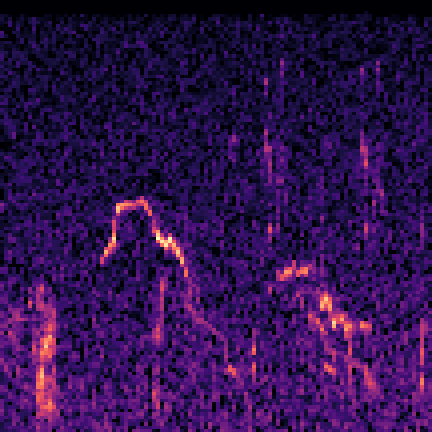
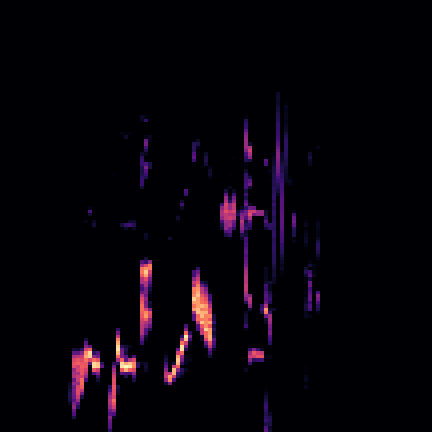

Bird song recognition
==============================

## Data download
Analysis and modelling of Polish birds songs. Recordings were downloaded from the - **[xeno-canto.org](https://www.xeno-canto.org/)** which is a website dedicated to sharing bird sounds from all over the world (480k, September 2019). 
We have downloaded song recordings for 33 classes of birds - recorded in Poland, Germany, Slovakia, Czech and Lithuania. Data can be dowloaded using [this jupyter notebook file](https://github.com/wimlds-trojmiasto/birds/blob/master/notebooks/AM_downloadData.ipynb). 

* 1 . Found  418  files for  Parusmajor ( 1 )
* 2 . Found  59  files for  Passerdomesticus ( 3 )
* 3 . Found  107  files for  Luscinialuscinia ( 4 )
* 4 . Found  111  files for  Phoenicurusphoenicurus ( 7 )
* 5 . Found  446  files for  Erithacusrubecula ( 8 )
* 6 . Found  80  files for  Phoenicurusochruros ( 10 )
* 7 . Found  134  files for  Sittaeuropaea ( 16 )
* 8 . Found  105  files for  Alaudaarvensis ( 17 )
* 9 . Found  216  files for  Phylloscopustrochilus ( 19 )
* 10 . Found  564  files for  Turdusphilomelos ( 21 )
* 11 . Found  314  files for  Phylloscopuscollybita ( 22 )
* 12 . Found  365  files for  Fringillacoelebs ( 23 )
* 13 . Found  65  files for  Sturnusvulgaris ( 24 )
* 14 . Found  329  files for  Emberizacitrinella ( 25 )
* 15 . Found  58  files for  Columbapalumbus ( 26 )
* 16 . Found  204  files for  Troglodytestroglodytes ( 27 )
* 17 . Found  53  files for  Cardueliscarduelis ( 30 )
* 18 . Found  97  files for  Chlorischloris ( 31 )
* 19 . Found  667  files for  Turdusmerula ( 33 )

## Data preprocessing
The data should be prepared. Each song is cut into 5 second recordings and preprocessed into melspectrograms. The purpose is to normalize dataset to have same size along the whole dataset in one run, and to denoise recordings. Morover, the data is filtered with a high-pass filter. Data can be preprocessed using [this jupyter notebook file](https://github.com/wimlds-trojmiasto/birds/blob/master/notebooks/AM_prepareData.ipynb).

## Dataset split
[This file](https://github.com/wimlds-trojmiasto/birds/blob/master/notebooks/AM_splitDataset.ipynb) divides our dataset into train, validation and test set. We can't use preprogrammed functions to do that, because we have divided each of our files into other smallers (i.e. one sound to six images). Putting images made out of same mp3 file might lead to the data leakage and make our results not trustworthy and biased.

## Training 
We approached the problem of song classification with Convolutional Neural Networks. We have tested it with:
* Xception 
* MobileNets
* EfficientNets
* Handcrafted CNN's
* Other

## Results
In progress

## Other
Project Organization
------------

    ├── LICENSE
    ├── Makefile           <- Makefile with commands like `make data` or `make train`
    ├── README.md          <- The top-level README for developers using this project.
    ├── data
    │   ├── external       <- Data from third party sources.
    │   ├── interim        <- Intermediate data that has been transformed.
    │   ├── processed      <- The final, canonical data sets for modeling.
    │   └── raw            <- The original, immutable data dump.
    │
    ├── docs               <- A default Sphinx project; see sphinx-doc.org for details
    │
    ├── models             <- Trained and serialized models, model predictions, or model summaries
    │
    ├── notebooks          <- Jupyter notebooks. Naming convention is a number (for ordering),
    │                         the creator's initials, and a short `-` delimited description, e.g.
    │                         `1.0-jqp-initial-data-exploration`.
    │
    ├── references         <- Data dictionaries, manuals, and all other explanatory materials.
    │
    ├── reports            <- Generated analysis as HTML, PDF, LaTeX, etc.
    │   └── figures        <- Generated graphics and figures to be used in reporting
    │
    ├── requirements.txt   <- The requirements file for reproducing the analysis environment, e.g.
    │                         generated with `pip freeze > requirements.txt`
    │
    ├── setup.py           <- makes project pip installable (pip install -e .) so src can be imported
    ├── src                <- Source code for use in this project.
    │   ├── __init__.py    <- Makes src a Python module
    │   │
    │   ├── data           <- Scripts to download or generate data
    │   │   └── make_dataset.py
    │   │
    │   ├── features       <- Scripts to turn raw data into features for modeling
    │   │   └── build_features.py
    │   │
    │   ├── models         <- Scripts to train models and then use trained models to make
    │   │   │                 predictions
    │   │   ├── predict_model.py
    │   │   └── train_model.py
    │   │
    │   └── visualization  <- Scripts to create exploratory and results oriented visualizations
    │       └── visualize.py
    │
    └── tox.ini            <- tox file with settings for running tox; see tox.testrun.org

--------

<small>Project based on the <a target="_blank" href="https://drivendata.github.io/cookiecutter-data-science/">cookiecutter data science project template</a>. #cookiecutterdatascience</small>

